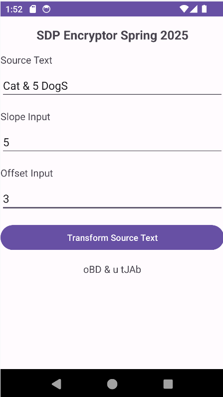
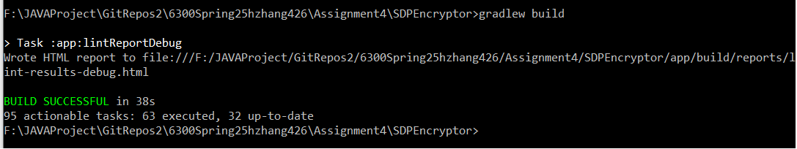

# Android Affine Cipher App

This repository contains an Android application that encrypts user-provided text using an affine cipher over an alphanumeric character set. The project demonstrates mobile UI implementation, input validation, deterministic text transformation logic, and specification-driven Android development in Java.

## Project Overview

This app transforms source text using an affine cipher defined over letters and digits. Users provide a source string, a slope parameter, and an offset parameter, then trigger the transformation through a button-driven interface.

The application supports both valid text transformation and structured error handling for invalid user inputs. Non-alphanumeric characters remain unchanged, while alphanumeric characters are encoded according to a defined affine mapping.

## Key Highlights

- Built an Android application in Java for text encryption
- Implemented affine-cipher-based transformation over letters and digits
- Added validation for source text, slope input, and offset input
- Preserved non-alphanumeric characters while transforming valid alphanumeric content
- Designed the UI around clearly defined input, output, and action components
- Structured the app to support specification-based testing and reproducible behavior

## Core Functionality

The app allows users to:

- Enter source text to be transformed
- Provide slope and offset parameters for the affine cipher
- Trigger transformation through a button
- View the transformed output in a non-editable text field
- Receive input-specific validation errors when values are invalid

## Technical Focus

This project emphasizes:

- Android UI development
- Java-based event-driven logic
- Input validation and error handling
- Deterministic text-processing behavior
- Building against a clear external specification

## Notes

- This repository is shared for project demonstration and portfolio purposes
- Course-specific assignment documents are not included here
- Some local IDE or build-environment files should be excluded from version control

## Demo

### App UI

### Build Result
