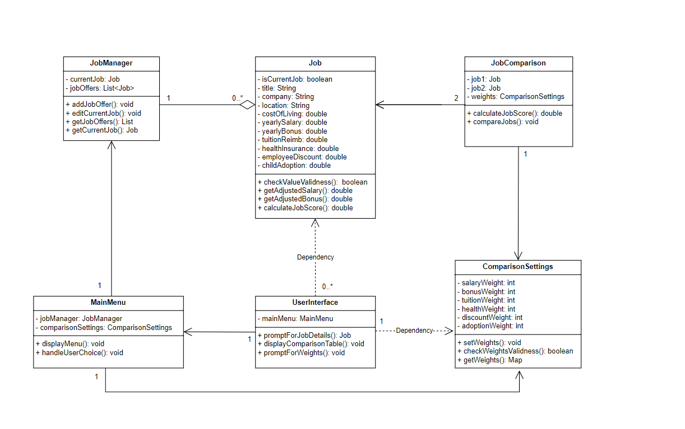
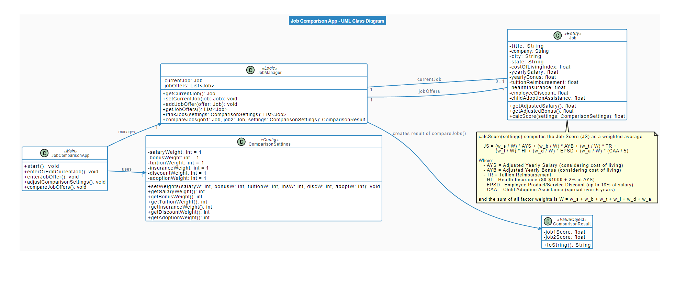
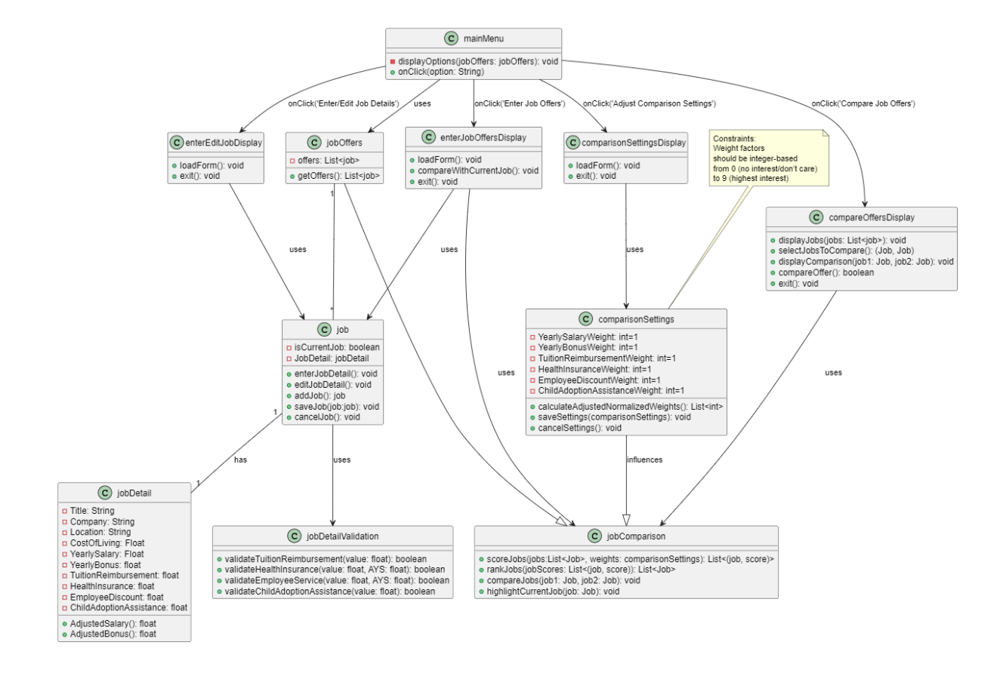
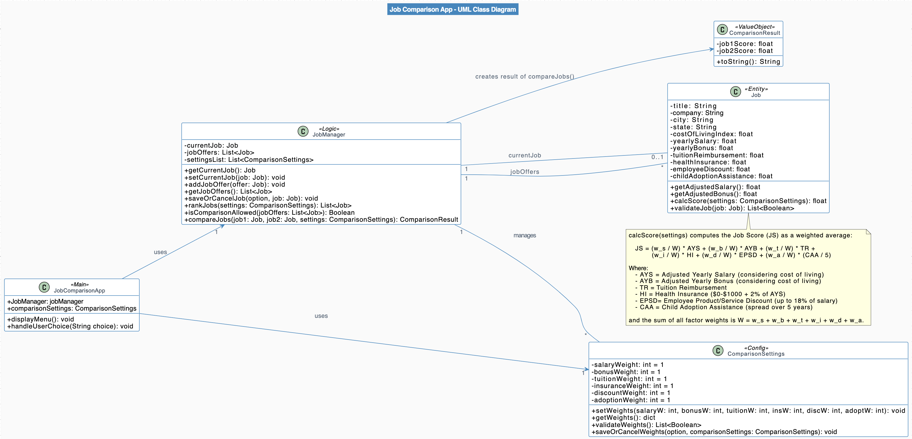

# Individual Designs
The Individual designs are as follows:

## *Design 1*

### Pros
- Main Menu handles User choice within one function efficiently.
- Job manager class takes care of both the current job instance and job offers separately for ease of access across multiple calls. 
- Job class contains all the required attributes. It also contains method for validity check and to calculate adjusted salary and bonus values for each job.
- Comparison weights class is implemented as per requirement and also takes care of validation checks.
### Cons
- Save and cancel feature is not implemented
- Rank Jobs function is not implemented
- Job score calculation method is redundant 
- comparisonSettings default values are not mentioned

## *Design 2*

### Pros
- Job manager class takes care of both the current job instance and job offers separately for ease of access across multiple calls. 
- Rank Jobs method  and compare Jobs method is implemented as per the requirements.
- Job class contains all attributes as per the requirement, and calculateScore method is also implemented in this class, instead of Job Manager as score is an attribute of job which is more efficient.

### Cons
- Main Menu is handling each user choice as individual functions.
- Validations on the user input not implemented.
- Save and cancel feature is not implemented

## *Design 3*

### Pros
- Main Menu handles User choice within one function efficiently.
- Save and Cancel methods are implemented as per requirement.
- job, comparisonSettings and job comparison methods are implemented as per requirement.
### Cons
- diplay classes are not required in the UML
- display functions can be ignored in UML documentation
- Current job instance is not separately defined.

# *Team Design*

### Commonalities and Added Features
- We are using jobManager, job and comparison Settings classes as defined in the individual designs. We added some methods (referencing from individual contributions) to satisfy the requirements, such as default values(design#2), input validation(design#1) and save/cancel functionalities(design#3).
- We implemented the entry point that is the Main Menu mentioned in all individual designs. We chose to implement the concise method for handling user choice, by passing "option" argument instead of defining separate methods for each functionality.
- Based on ideas taken from design#3, jobManager class includes a function to check if job comparison is allowed or not, as it affects the main menu display.
- We implemented job Comparison within the scope of job manager class, essentially removing extra class definitions that are not required to implement the functionalities mentioned.
- We added notes to the UML design to define the job score calculation logic, as per design#2.

# *Summary*
During the course of this project, we learnt:-
- How to make our designs more concise by removing redundant features or classes that do no specifically isolate any functionality.
- Discussing individual designs and motivations, to incorporate in the final team design helped us learn new ways of implementation which makes the design more concise and efficient and easy to understand.
- How to extract the key requirements and strategize the best possible implementation while still taking individual contributions into consideration.
