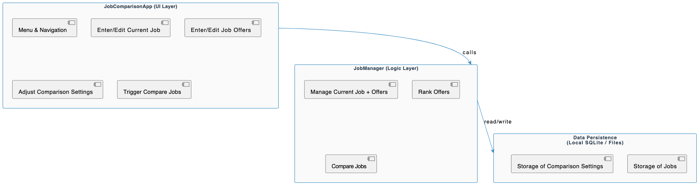
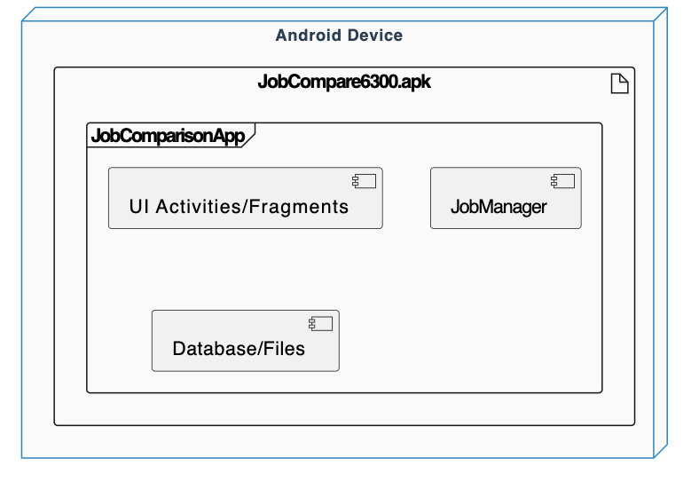
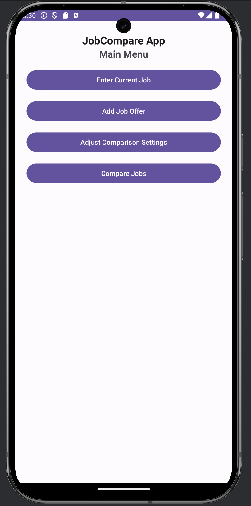
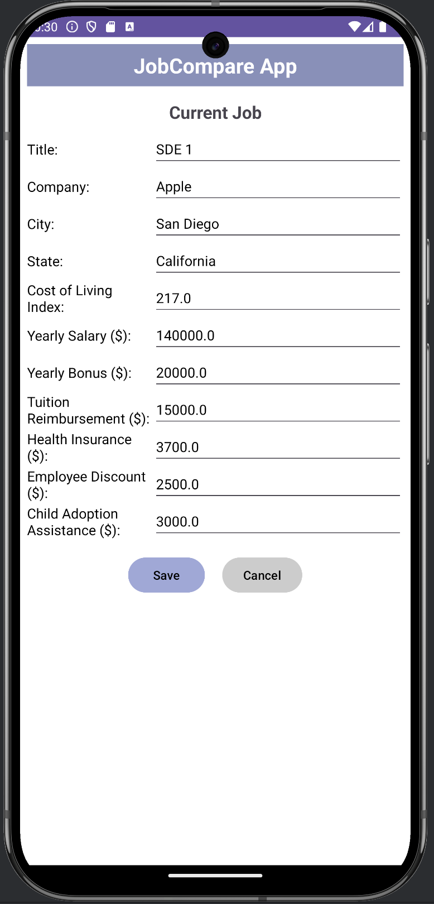
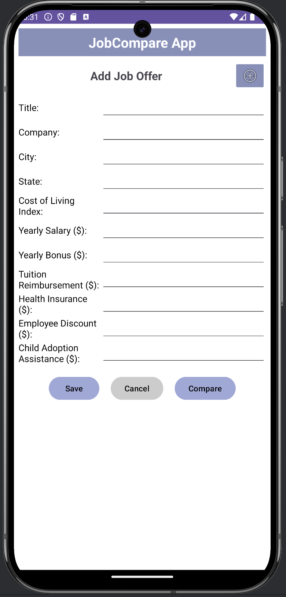
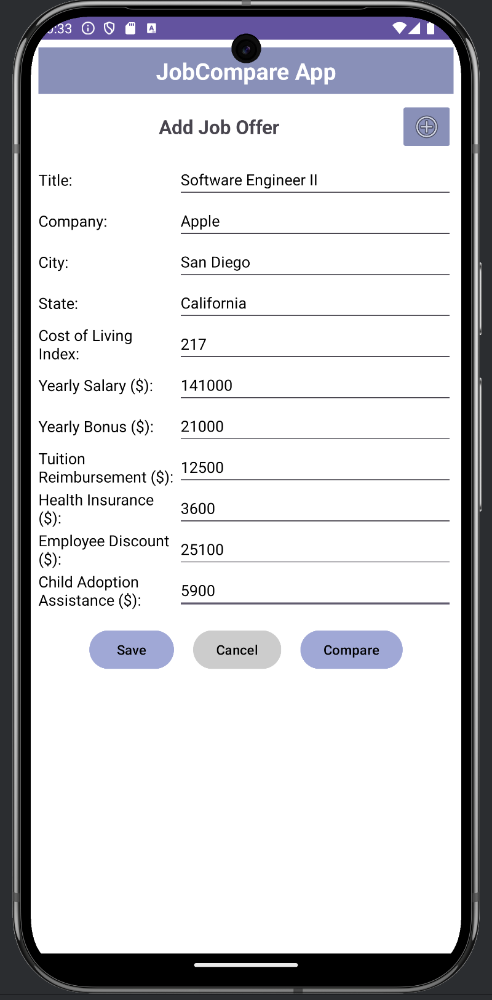
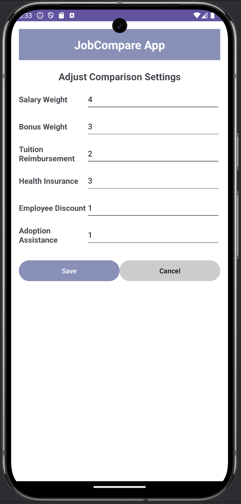
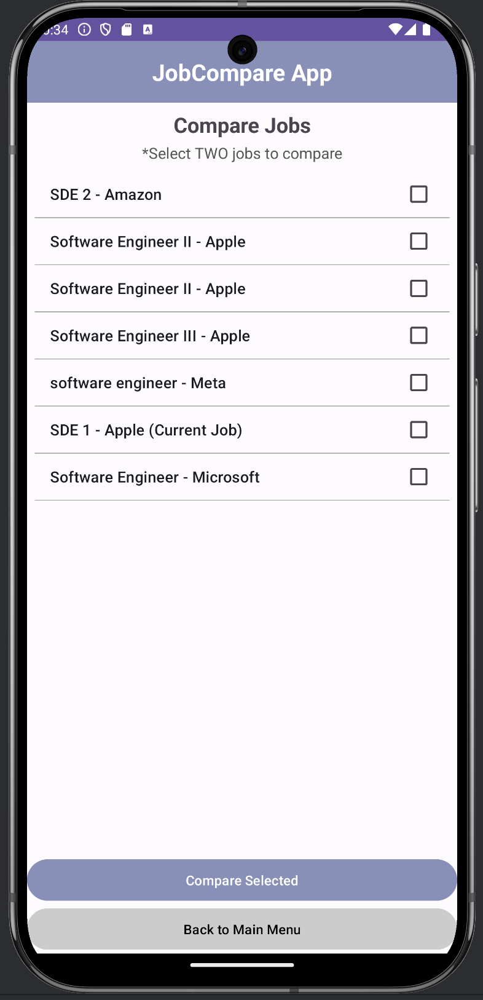
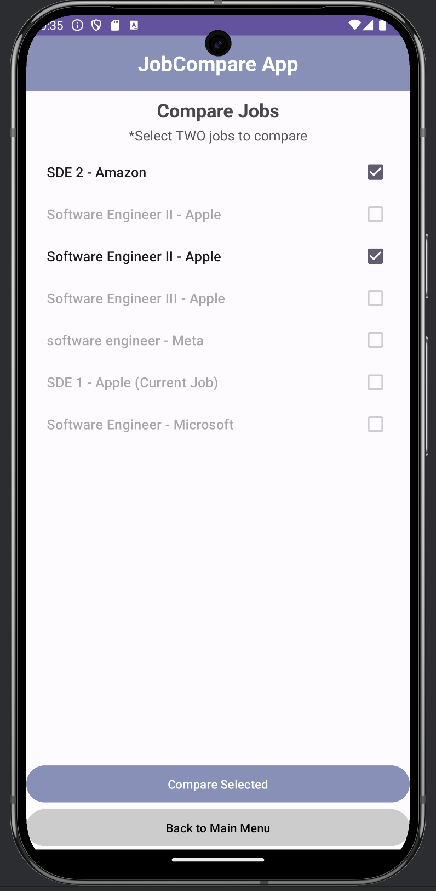
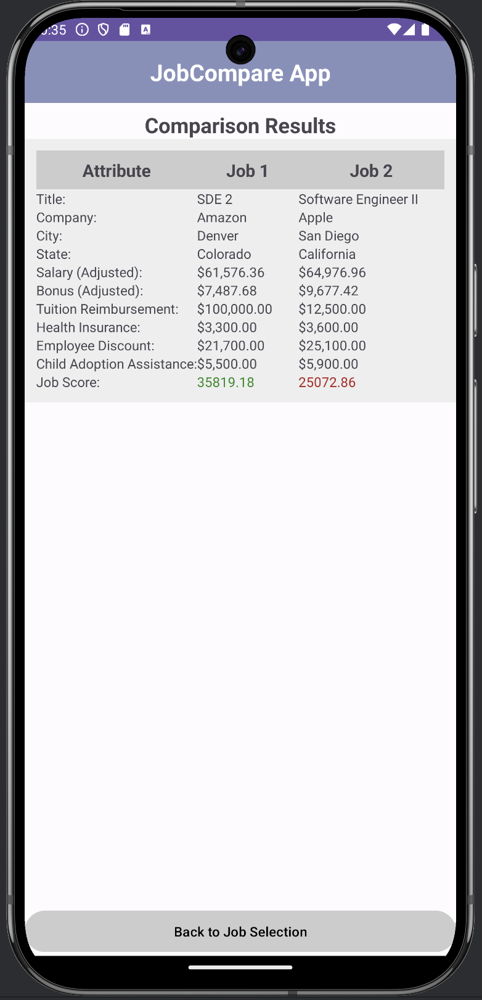

# Design Document

**Author**: *Kanaka Raju Sampathi Rao*

---

## 1. Design Considerations

### 1.1 Assumptions
- The app is **single-user**, with no multi-user or server-side components.
- Runs on a **single Android device**; data stored locally (SQLite or files).
- End users have **basic familiarity** with job offer data (e.g., salary, bonus, cost of living).
- All calculations (scores, weights) follow the **formula** agreed upon in Deliverable 1.
- The user will **manually enter** data for the current job and any job offers.

### 1.2 Constraints
- Must target **Android API 34 (Android 14)** for minSdk, compileSdk, and targetSdk.
- Must persist data so that it **survives app restarts** (SQLite or local file storage).
- Must implement **weighted job comparison** with adjustable integer weights (0–9).
- Must display side-by-side comparisons and rank job offers by **score**.

### 1.3 System Environment
- **Hardware**: Android smartphone/tablet.
- **Operating System**: Android 14 (API Level 34).
- **Development Tools**: Android Studio (latest version), Git for version control.
- **Programming Language**: Java or Kotlin.
- **Database**: Android Room Database

---

## 2. Architectural Design

### 2.1 Component Diagram
Below is a **high-level** view of the system’s main components and their relationships. This diagram focuses on **logical groupings** of functionality rather than specific classes.

**Description of Components**  
1. **JobComparisonApp (UI Layer)**  
   - Provides **screens** for job entry, offers, and comparison settings.  
   - Invokes `JobManager` to handle business logic.

2. **JobManager (Logic Layer)**  
   - Manages **current job** and **job offers**.  
   - Applies **ComparisonSettings** to compute scores/rankings.

3. **Data Persistence**  
   - Stores data in **SQLite** (preferred) or file-based approach.  
   - Allows saving/loading **Job** details and **ComparisonSettings**.

### 2.2 Deployment Diagram
Since this is a **single-device** application, the deployment is straightforward.

- **Android Device**: Physical phone/tablet or emulator running Android 14.  
- The `JobCompare6300.apk` package contains **all components** of the app.  
- No external servers or network dependencies.

---

## 3. Low-Level Design

### 3.1 Class Diagram
Below is the **final Class Diagram** from Deliverable 1, showing the classes, attributes, methods, and relationships. In your final submission, you can embed a generated or manually drawn version of this diagram.

#### **Key Classes & Responsibilities**
- **JobComparisonApp** (Main/Controller)  
  Displays menus and handles user choices; delegates job-related requests to `JobManager`.

- **JobManager** (Logic Layer)  
  Holds the **current job** and a **list of job offers**. Performs comparisons and ranking using weights from `ComparisonSettings`.

- **Job** (Entity)  
  Represents a single job (title, company, city/state, cost of living, compensation, etc.).  
  Provides score calculation with cost-of-living adjustments.

- **ComparisonSettings** (Config)  
  Stores **weight factors** for scoring.  
  Allows user to update weights (0–9).  
  Validates weights and can persist them.

- **ComparisonResult** (Value Object)  
  Created by `JobManager` to hold final scores for job comparisons.

### 3.2 Other Diagrams
**Optional**: Add sequence diagrams or state diagrams to clarify dynamic flows, such as:
- **Adding a job offer**  
- **Editing comparison settings**  
- **Comparing two selected jobs**

---

## 4. User Interface Design

# Job Comparison App - UI Flow

Enclosed are the screenshot images of the user interface for Deliverable 3 of the APP we have completed. The final version of the APP will generally feature an identical user interface.

| Step 1: Main Menu | Step 2: Fill current Job Details |
|------------------|----------------------|
|  |  |

| Step 3: Add New Job Offer | Step 4: Enter Job Offer |
|------------------|----------------------|
|  |  |

| Step 5: Adjust Comparison Settings | Step 6: List and Rank the Jobs |
|------------------|----------------------|
|  |  |

| Step 7: Select Jobs to Compare | Step 8: View Comparison Results |
|------------------|----------------------|
|  |  |

---
