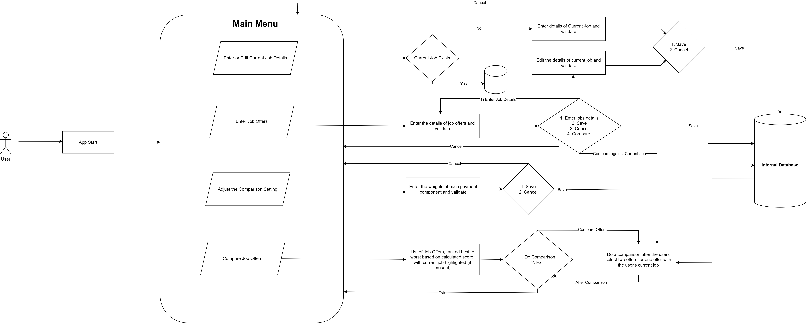

# Use Case Model

**Author**: Hao Zhang

## 1 Use Case Diagram

Below is our use case diagram: 

## 2 Use Case Descriptions

### **Use Case #1 - User Login and Onboarding**  
#### **General Scenario in the User Journey:**  
Once a user attempts to use an app, the initial step is typically user login. First-time users generally need to register before they can log into the system using their registration credentials. 

However, in our proposed job comparison app, this step has been omitted. Users can automatically access the app upon launching it on their mobile device without needing to log in.

### **Use Case #2 - Enter/Edit Current Job**  

#### **General Scenario in the User Journey:**  
After the user successfully logs into the system, they will be presented with the main menu. Given that the primary function of this proposed app is to compare job offers, including comparing a prospective offer with the user's current position, the first step will be to prompt the user to enter or update their current job information.

#### **Description:**  
Allows user to enter or update the details of his or her current job.

#### **Pre-conditions:**  
- The user has access to the app and successfully log into the APP.  

#### **Post-conditions:**  
- Job details are saved successfully as current job with no missing fields  

#### **Procedures of the Scenarios:**  
1. The user selects "Enter/Edit Current Job".
2. If a current job already exists, it will be displayed and the user can choose to edit it. Otherwise, a blank form will appear and permit the user to input the details of the job.
3. The user enters job details and can either choose Save or Cancel. Both options will then return to the main menu.
     1. Click "Save" to save the job details in the database as the current job.
     2. Click "Cancel" to exit to the Main Menu without saving the input details.

---

### **Use Case #3 - Enter Job Offer**  

#### **General Scenario in the User Journey:**  
After the user has entered or updated their current job information, they will be returned to the main menu. If the user chooses to proceed with providing details of new job offers, the system will prompt them to input this information. These new job offers will be used for subsequent job comparison tasks, which constitute the primary function of the app.

#### **Description:**  
Allows user to enter one or more job offers with the corresponding details.  

#### **Pre-conditions:**  
- The user has access to the app.   

#### **Post-conditions:**  
- The job details have been saved successfully as new job offers without any missing fields, and the input values are within the predefined range.

#### **Procedures of the Scenarios:**  
1. The user selects "Enter Job Offer".  
2. The user are prompt to fill in the job details and then selects Save/Cancel.
     1. Click "Save" to save the job details in the database as one of the job offers (all job offers will be stored as a list in our design).
     2. Click "Cancel" to exit to the Main Menu without saving the input details.

3. If the user selects 'Save' in step 2, several options will then be presented to the user:  
   - The user can press the ‘Add Another Offer’ button to add another job offer.  
   - The user can press the ‘Compare Offer with Current Job’ button for a comparison with the current job (only if the current job exists). 
   - The user can press the ‘Compare Two Offers’ button for a comparison between two offers (only when at least two offers are stored in the system). After pressing this button, all the available offers stored in the database will then be presented to the user and ranked from best to worst based on the calculated job score, and the user will be prompted to select two from them for comparison.
   - The user can also press the ‘Return to Main Menu’ button to return to the menu at any time during the manipulation.

---

### **Use Case #4 - Adjust Comparison Settings**  

#### **General Scenario in the User Journey:**  
The user may have distinct considerations for each payment component associated with a particular job offer, leading to the assignment of specific weights to each component. Our proposed application enables users to assign custom weights to each payment component as needed, while also providing default values for those components if no specific weights are provided.

#### **Description:**  
Allows the users to input and adjust the weight of each payment component.  

#### **Pre-conditions:**  
- The user has access to the app.

#### **Post-conditions:**  
- The new weights for each payment component are checked for validity and then saved if they are valid. 

#### **Procedures of the Scenarios:**  
1. The user selects the ‘Comparison Settings’ button from the Main Menu.  
2. The user is prompted to set the weight of each payment component one by one. For each input, the system will check its validity (0 to 9 integer) and set it to each corresponding component if valid; otherwise, it will ask the user to input the value again. The user can also select to skip this step , and if no values are set, the default value for each factor is set to 1. 
3. The user can choose to either save or cancel the settings of the weight.
    1. Click "Save" to save the input weight into the internal database for job score calculation.
    2. Click "Cancel" to exit to the Main Menu without saving the input weight.

---

### **Use Case #5 - Compare Job Offers**  

#### **General Scenario in the User Journey:**  
After providing the job offers and assigning weights to each payment component, the user may wish to compare two new offers or a new offer with their current position to facilitate an informed selection. The user can select two offers from the job offer list, or one offer from the list and their current position, for comparative analysis. The application will then display the comparison results to the user by a table.

#### **Description:**  
Allows the user to compare two jobs.

#### **Pre-conditions:**  
- At least two jobs exist in the database (either two job offers or one job offer along with the current job stored in the system).  

#### **Post-conditions:**  
- A job comparison table will be displayed .  

#### **Procedures of the Scenarios:**  
1. Once the users activate this function, they will be presented all the jobs (including their current one and new job offers)
stored in the database, ranked from the best to worst based on the calcualted job scores.
2. The user selects the "Compare Job Offers" button to activate the job comparison task.
3. The user selects two jobs from the job list and presses the ‘Compare’ button to proceed, or presses the ‘Cancel’ button to return to the selection menu.
4. If the ‘Compare’ button is selected, the user will then be presented with a job comparison table showing a side-by-side comparison of the two selected jobs. 
